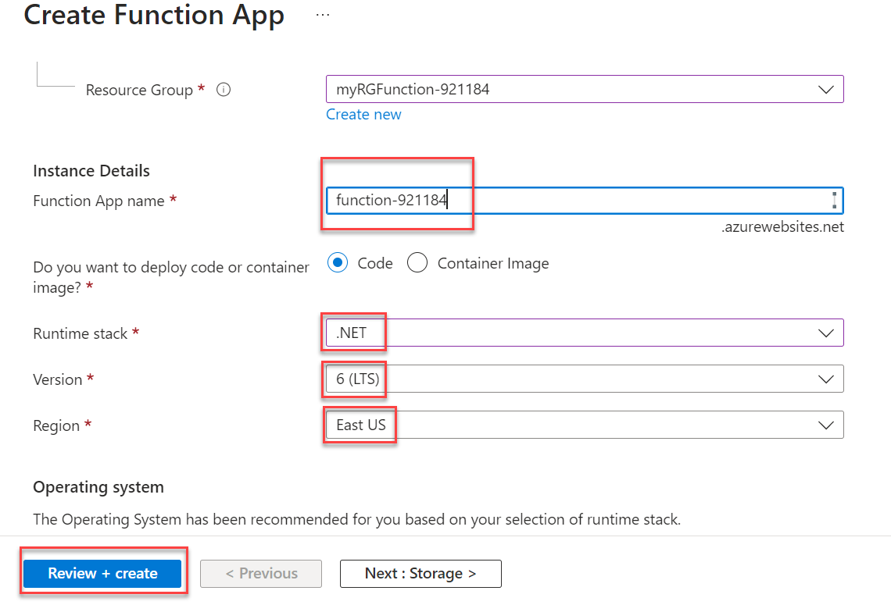

# 08 - Implement Azure Functions

In this walkthrough, we will create a Function App to display a Hello message when there is an HTTP request. 

# Task 1: Create a Function app

In this task, we will create a Function app.

1. Click on the Azure Portal icon on the VM desktop.

1. In the **Search resources, services, and docs** text box at the top of the portal, search for and select **Function App** and then, from the **Function App** blade, click **+ Create**.

1. On the **Basic** tab of the **Function App** blade, specify the following settings and leave all others with their default values: 

    | Settings | Value |
    | -- | --|
    | Subscription | the name of your Azure subscription |
    | Resource group | the name of **existing** resource group **myRGFunction-<inject key="DeploymentID" enableCopy="false"/>**  |
    | Function App name | **function-<inject key="DeploymentID" enableCopy="false"/>** |
    | Publish | **Code** |
    | Runtime stack | **.NET** |
    | Version | **6 (LTS)** |
    | Region | **East US** |
    | | |
    
    
    
4. Click **Review + Create** and, after successful validation, click **Create** to begin provisioning and deploying your new Azure Function App.

5. Wait for the notification that the resource has been created.

6. Navigate back to the **Function App** blade, click **Refresh** and verify that the newly created function app has the **Running** status. 

    

# Task 2: Create a HTTP triggered function and test

In this task, we will use the Webhook + API function to display a message when there is an HTTP request. 

1. On the **Function App** blade, click the newly created function app. 

1. On the function app blade, in the **Functions** section, click **Functions** and then click **+ Create**.

    

1. On the **Templates** tab of the **Create Function** blade, click **HTTP trigger**. Click **Create**  

    

1. On the **HttpTrigger1** blade, in the **Developer** section, click **Code + Test**. 

1. On the **HttpTrigger1 \| Code + Test** blade, review the auto-generated code and note that the code is designed to run an HTTP request and log information. Also, notice the function returns a Hello message with a name. 

    

1. Click **Get function URL** from the top section of function editor. 

1. Ensure that the value in the **Key** drop-down list is set to **default** and click **Copy** to copy the function URL. 

    

1. Open a new browser tab and paste the copied function URL into your web browser's address bar. When the page is requested the function will run. Notice the returned message stating that the function requires a name in the request body.

    

1. Append **&name=*yourname*** to the end of the URL.

    **Note**: Replace ***yourname*** with your first name. For example, if your name is Cindy, the final URL will resemble the following `https://azfuncxxx.azurewebsites.net/api/HttpTrigger1?code=X9xx9999xXXXXX9x9xxxXX==&name=cindy`

    

<!--1. When your function runs, every invocation is traced. To view the traces in Azure portal, return to the **HttpTrigger1** blade, in the **Developer** section, click **Monitor**. For more advanced analysis, click **Run query in Application Insights**.

     -->

   > **Congratulations** on completing the task! Now, it's time to validate it. Here are the steps:
   > - Click the (...) icon located at the upper right corner of the lab guide section and navigate to the Lab Validation Page.
   > - Hit the Validate button for the corresponding task.If you receive a success message, you can proceed to the next task. 
   > - If not, carefully read the error message and retry the step, following the instructions in the lab guide.
   > - If you need any assistance, please contact us at labs-support@spektrasystems.com. We are available 24/7 to help you out. 

1. Select the **Resources** tab, then in actions select deallocate for deallocated the VM, it will be Cost effective.
