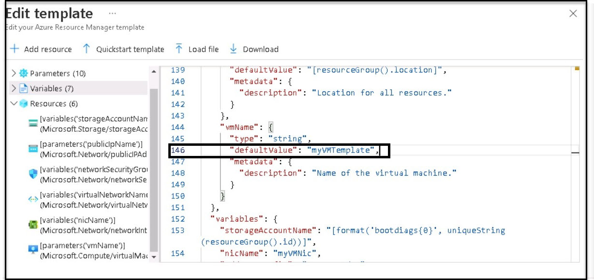

# 09 - Create a VM with a Template

In this walkthrough, we will deploy a virtual machine with a QuickStart template and examine monitoring capabilities.

# Task 1: Explore the gallery and locate a template

In this task, we will browse the Azure QuickStart gallery and deploy a template that creates a virtual machine.

1. Double click on the **Microsoft Edge** icon on the VM desktop to open the browser

2. In a new tab, access the [Azure Quickstart Templates gallery](https://azure.microsoft.com/resources/templates?azure-portal=true). In the gallery, you will find many popular and recently updated templates. These templates automate the deployment of Azure resources, including the installation of popular software packages.

3. Browse through the many different types of templates that are available. Are there any templates that are of interest to you?

4. Search and Select the **Deploy a simple Windows VM**.

    **Note**: The **Deploy to Azure** button enables you to deploy the template via the Azure portal. During such deployment, you will be prompted only for a small set of configuration parameters. 

5. Click the **Deploy to Azure** button. Your browser session will be automatically redirected to the [Azure portal](http://portal.azure.com/).

6. If prompted, sign in to the Azure with the **Username** <inject key="AzureAdUserEmail"></inject> and **Password** <inject key="AzureAdUserPassword"></inject>.

7. Click **Edit template**. The Resource Manager template format uses the JSON format. Review the parameters and variables.  Then Open **Parameter** file and locate the parameter for the virtual machine name. Go to line no 109 and Change the name to **myVMTemplate**, and **Save** your changes. 

    

8. Now configure the parameters required by the template. Leave the defaults for everything else. 

    | Setting| Value|
    |----|----|
    | Subscription | **Choose your subscription**|
    | Resource group | **myRGTemplate-<inject key="DeploymentID" enableCopy="false"/>** (use existing) |
    | Region | **Keep default** |
    | Admin username | **azureuser** |
    | Admin password | **Pa$$w0rd1234** |
    | DNS label prefix | **myvmtemplate-<inject key="DeploymentID" enableCopy="false"/>** |
    | Windows OS version | **2019-datacenter-gensecond** |

    
  9. Click **Review + Create**.
  10. Click the **Create** 
  11. Monitor your deployment. 

# Task 2: Verify and monitor your virtual machine deployment

In this task, we will verify the virtual machine is deployed correctly. 

1. From the **Search resources, services, and docs** blade, search for and select **Virtual machines**.

2. Ensure your new virtual machine was created. 

    

3. Select your virtual machine and on the **Overview** pane scroll down to view monitoring data.

    **Note**: The monitoring timeframe can be adjusted from one hour to 30 days.

4. Review different charts that are provided including **CPU (average)**, **Network (total)**, and **Disk bytes (total)**. 

    

5. Click on any chart. Note that you can **Add metrics** and change the chart type.

6. Return to the **Overview** blade.

7. Click on the **Activity log** (left pane). Activity logs record such events as the creation or modification of resources. 

8. Click **Add filter**, and experiment with searching for different event types and operations. 

    

   > **Congratulations** on completing the task! Now, it's time to validate it. Here are the steps:
   > - Click the (...) icon located at the upper right corner of the lab guide section and navigate to the Lab Validation Page.
   > - Hit the Validate button for the corresponding task.If you receive a success message, you can proceed to the next task. 
   > - If not, carefully read the error message and retry the step, following the instructions in the lab guide.
   > - If you need any assistance, please contact us at labs-support@spektrasystems.com. We are available 24/7 to help you out.

9. Select the **Resources** tab, then in actions select deallocate for deallocated the VM, it will be Cost effective.
