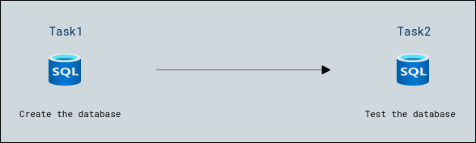

# Lab Scenario Preview: 

## Lab 06 - Create a SQL database

### Lab overview

In this walkthrough, we will create a SQL database in Azure and then query the data in that database.

## Objectives

After completing this lab, you will be able to:

- Create the database
- Test the database.

## Architecture Diagram

Now that you know what the lab is going to be all about, you can launch next item **Hands-on Lab** which includes lab environment and lab guide. You can also preview the full lab guide [here](https://experience.cloudlabs.ai/#/labguidepreview/e598292d-73be-4782-8fcf-f02f3f5411d9) if you want to go through detailed guide prior to launching lab environment.