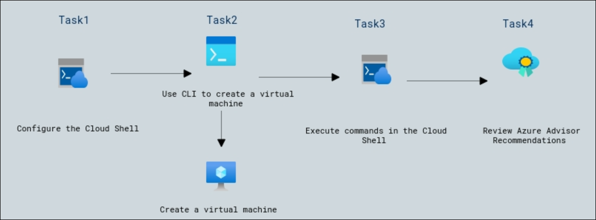

# Lab Scenario Preview: AZ-900: Azure Fundamentals: Describe Azure architecture and services

## Lab 11 - Create a VM with the CLI

### Lab overview

In this walkthrough, we will configure the Cloud Shell, use Azure CLI to create a virtual machine, and review Azure Advisor recommendations.

## Objectives

After completing this lab, you will be able to:

- Configure the Cloud Shell
- Use CLI to create a virtual machine
- Execute commands in the Cloud Shell
- Review Azure Advisor Recommendations

## Architecture Diagram

Now that you know what the lab is going to be all about, you can launch next item **Hands-on Lab** which includes lab environment and lab guide. You can also preview the full lab guide [here](https://experience.cloudlabs.ai/#/labguidepreview/b234120e-8ad5-4f10-b4fd-75f20e5518d7) if you want to go through detailed guide prior to launching lab environment.