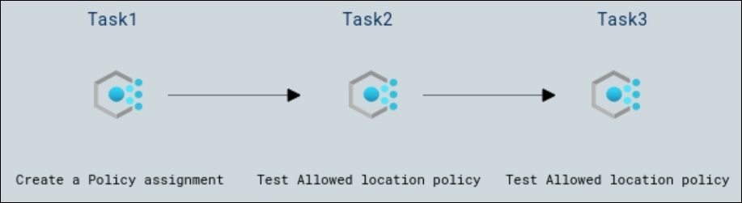

# Lab Scenario Preview: AZ-900: Azure Fundamentals: Describe Azure management and governance

## Lab 17 - Create an Azure Policy

### Lab overview

In this walkthrough, we will create an Azure Policy to restrict the deployment of Azure resources to a specific location.

## Objectives

After completing this lab, you will be able to:

- Create a Policy assignment
- Test Allowed location policy
- Delete the policy assignment

## Architecture Diagram

Now that you know what the lab is going to be all about, you can launch next item **Hands-on Lab** which includes lab environment and lab guide. You can also preview the full lab guide [here](https://experience.cloudlabs.ai/#/labguidepreview/2324ce51-fff7-46e5-b61f-f0e7b3e9d759) if you want to go through detailed guide prior to launching lab environment.