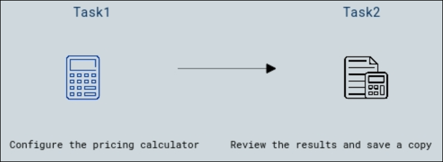

# Lab 19 - Use the Pricing Calculator

## Lab overview

The Pricing Calculator is a tool provided by Microsoft Azure that allows users to estimate and understand the cost of Azure services before deployment. It enables users to explore various Azure products and services, configure different options and parameters, and generate cost estimates based on usage patterns and requirements.

In this walkthrough, we will use the Azure Pricing Calculator to generate a cost estimate for an Azure virtual machine and related network resources.

## Lab objectives

In this lab, you will complete the following tasks:

+ Task 1: Configure the pricing calculator
+ Task 2: Review the pricing estimate

## Estimated timing: 10 minutes

## Architecture diagram

### Task 1: Configure the pricing calculator

In this task, we will estimate cost of a sample infrastructure by using the Azure Pricing Calculator. 

**Note**: To create an Azure Pricing Calculator estimate, this walkthrough provides example configurations for the VM and related resources. Use this example configurations or provide the Azure Pricing Calculator with details of your *actual* resource requirements instead.

1. In your edge browser, navigate to the [Azure Pricing Calculator](https://azure.microsoft.com/en-us/pricing/calculator/) webpage.

1. To add details of your VM configuration, click **Virtual Machines** on the **Products** tab and subsequently click on **View** in the pop-up that appears. Scroll down to view the virtual machine details. 

   

1. Replace **Your Estimate** and **Virtual Machines** text with more descriptive names for your Azure Pricing Calculator estimate and your VM configuration. This walkthrough example uses **My Pricing Calculator Estimate** for the estimate.

   

1. Modify the default VM configuration.

    | Region | Operating system | Type |
    |------|----------------|----|
    | North Europe | Windows | (OS only) |
    | | |

    | Tier | Instance |
    |----|--------|
    | Standard | A2: 2 Core(s), 3.5 GB RAM, 135 GB Temporary storage |
    | | |

   

    **Note**: The VM instance specifications and pricing may differ from those in this example. Follow this walkthrough by choosing an instance that matches the example as closely as possible. 

1. Set the **Savings Options** to **Pay as you go**.

   

1. In Azure, a month is defined as 730 hours. If your VM needs to be available 100 percent of the time each month, you set the hours-per-month value to `730`. This walkthrough example requires one VM to be available 50 percent of the time each month.

    Leave the number of VMs set at `1`, and change the hours-per-month value to `365`.

   

1. Scroll down and in the **Managed OS Disks** pane, modify the default VM storage configuration.

    | Tier | Disk size | Number of disks | Snapshot | Storage transactions |
    | ---- | --------- | --------------- | -------- | -------------------- |
    | Standard HDD | S30: 1024 GiB | 1 | Off | 10,000 |

   

1. To add networking bandwidth to your estimate, go to the top of the Azure Pricing Calculator webpage. Click **Networking** in the product menu on the left, then click the **Bandwidth** tile. In the **Bandwidth added** message dialog, click **View**.

   

1. Add a name for your VM bandwidth configuration. This walkthrough example uses the name **Bandwidth: Windows VM**. Modify the default bandwidth configuration by adding the following details.

    | Region | Outbound Data Transfer Amount |
    | ------ | -------------------------------------- |
    | North Europe | 50 GB |

   

1. To add an Application Gateway, return to the top of the Azure Pricing Calculator webpage. In the **Networking** product menu, click the **Application Gateway** tile. In the **Application Gateway** message dialog, click **View**.

    

1. Add a name for your Application Gateway configuration. This walkthrough uses the name **App Gateway: Windows VM**. Modify the default Application Gateway configuration by adding the following details.

    | Region | Tier | Size | 
    | ------ | ---- | ---- |
    | North Europe | Basic | Small |
    | | |

    | Instances | Hours |
    | ------- | ------- |
    | 1 | 365 |
    | | |

    | Data processed |
    | -------------- |
    | 50 GB |
    | | |

    | Zone 1: North America, Europe |
    | ----------------------------- |
    | 50 GB |
    | | |

   

### Task 2: Review the pricing estimate

In this task, we will review the results of the Azure Pricing Calculator. 

1. Scroll to the bottom of the Azure Pricing Calculator webpage to view total **Estimated monthly cost**.

   >**Note**: Explore the various options available within the Azure Pricing Calculator. For example, this walkthrough requires you to update the currency to Euro.

1. Change the currency to Euro, then select **Export** to download a copy of the estimate for offline viewing in Microsoft Excel (`.xlsx`) format.

    
   
1. Open the downloaded Cost Estimation Sheet.

   
   
    >**Congratulations!** You downloaded an estimate from the Azure Pricing Calculator.

### Review
In this lab, you have completed:
- Configure the pricing calculator
- Review the pricing estimate

## Reference links

- https://azure.microsoft.com/en-gb/pricing/#product-pricing

- https://learn.microsoft.com/en-us/azure/cost-management-billing/costs/pricing-calculator
  
## You have successfully completed this lab.
