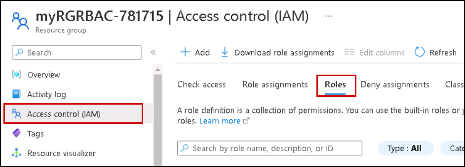
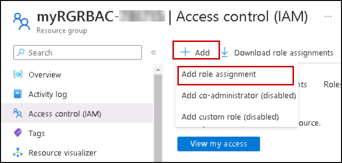
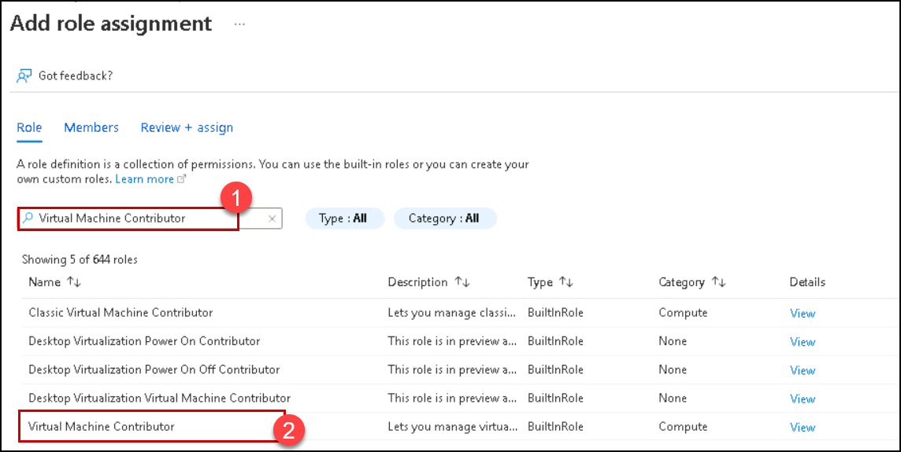
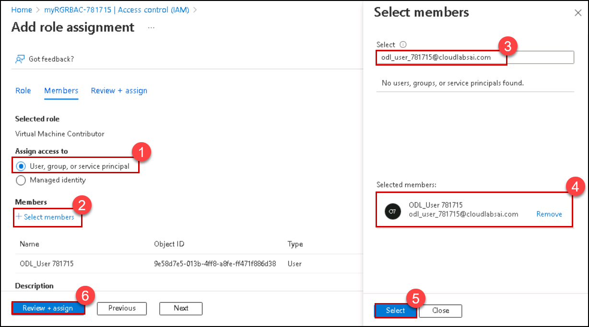
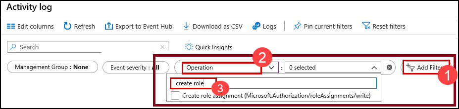

---
wts:
    title: '14 - Manage access with RBAC (5 min)'
    module: 'Module 05: Describe identity, governance, privacy, and compliance features'
---
# 14 - Manage access with RBAC (5 min)

In this walkthrough, we will assign permission roles to resources and view logs.

# Task 1: View and assign roles

In this task, we will assign the Virtual machine contributor role. 

1. Sign in to the [Azure portal](https://portal.azure.com).

2. From the **All services** blade, search for and select **Resource groups**, then click **+Add +New +Create**.

3. Create a new resource group. Click **Create** when you are finished. 

    | Setting | Value |
    | -- | -- |
    | Subscription | **Use default provided** |
    | Resource group | **myRGRBAC** |
    | Region | **(US) East US** |
   

4. Create **Review + create** and then click **Create**.

5. **Refresh** the resource group page and click the entry representing the newly created resource group.

6. Click on the **Access control (IAM)** blade, and then switch to the **Roles** tab. Scroll through the large number of roles definitions that are available. Use the Informational icons to get an idea of each role's permissions. Notice there is also information on the number of users and groups that are assigned to each role.
 
    

7. Click on **+ Add** and then click on **Add role assignment**. 

    

8. Search for the **Virtual Machine Contributor (1)** role and select **Virtual Machine Contributor (2)**. 

    
   

9. Switch to the **Members** tab and Assign access to: **User, group, or service principal (1)**. Then click on **+ Select members (2)** and type in your name to the popup search function and click on **select (5)**. then hit **Review and Assign (6)**.

    

    **Note:** The Virtual machine contributor role lets you manage virtual machines, but not access their operating system or manage the virtual network and storage account they are connected to.  

8. **Refresh** the Role assignments page and ensure you are now listed as a Virtual machine contributor. 

    **Note**: This assignment does not actually grant you any additional provileges, since your account has already the Owner role, which includes all privilges associated with the Contributor role.

# Task 2: Monitor role assignments and remove a role

In this task, we will view the activity log to verify the role assignment, and then remove the role. 

1. On the myRGRBAC resource group blade, click on **Activity log**.

2. Click on **Add filter (1)**, select **Operation (2)**, and then **Create role assignment (3)**.

    

3. Verify the Activity log shows your role assignment. 

    **Note**: Can you figure out how to remove your role assignment?

Congratulations! You created a resource group, assigned an access role to it and viewed activity logs. 

**Note**: To avoid additional costs, you can optionally remove this resource group. Search for resource groups, click your resource group, and then click **Delete resource group**. Verify the name of the resource group and then click **Delete**. Monitor the **Notifications** to see how the delete is proceeding.

